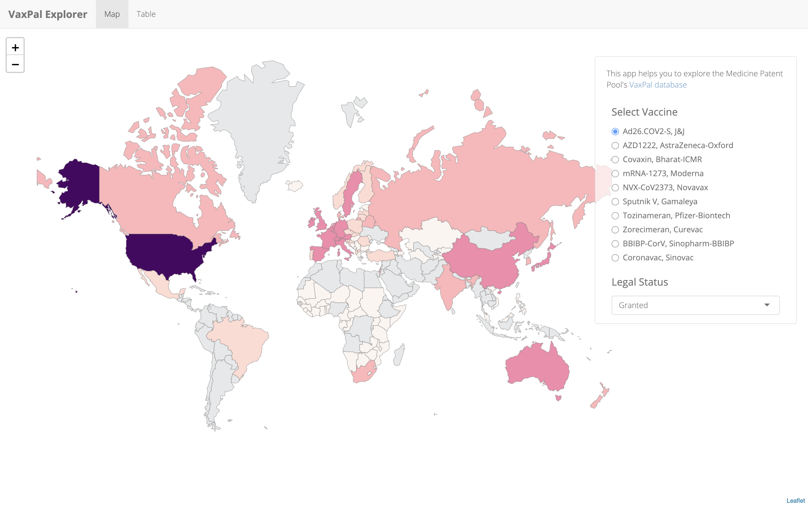
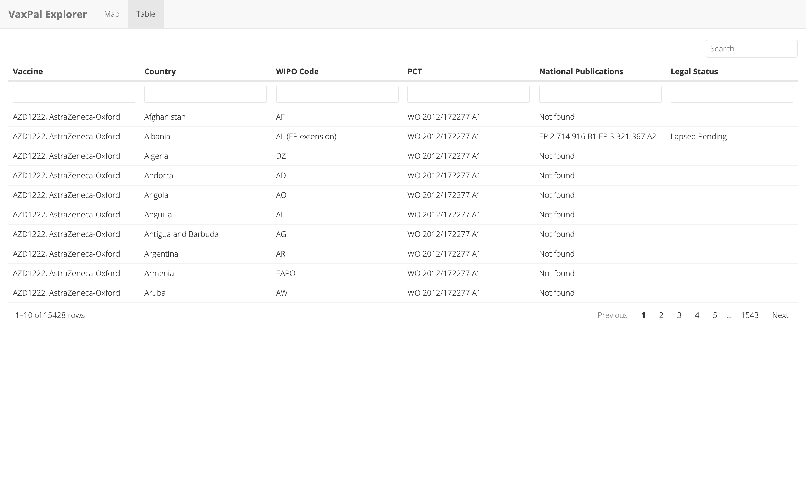

# Vaxpal Explorer

Shiny app exploring the Medicine Patent Pool's' COVID-19 vaccines patent landscape. 

## Screenshots
### Map

### Table

## Credits

* Code: shiny/js code adapted from [blackspot](https://github.com/blmoore/blackspot).
* Data: VaxPaL – COVID-19 vaccines patent landscape [vaxpal](https://medicinespatentpool.org/what-we-do/disease-areas/vaxpal/).
